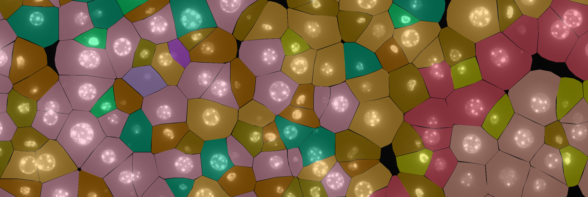

# Analysis of Spatial Transcriptomics Data

Welcome to our **hands-on workbook collection** to learn spatial transcriptomics data analysis!

Spatial transcriptomics allows us to measure gene expression across tissue sections while preserving spatial information, helping us understand not just **what** genes are active, but **where** they are active.

With our workbooks, you will explore how to analyze spatial transcriptomics data using **R** and **RStudio**. Whether you're new to spatial data or already familiar with single-cell workflows, our guides will walk you through the essential steps.

**Table of contents**

- [Workbooks overview](#workbooks-overview)
- [Credits](#credits)
- [Contributions](#contributions)
- [Citation](#citation)
- [Quick Start](#quick-start)

## Workbooks overview 📘

Our workbooks cover:

- Learn how to load spatial data into R and examine how the data is structured
- Key steps in the analysis workflow, including quality control, preprocessing, clustering and visualisation, cluster annotation, spatial clustering, and integration with single-cell transcriptomics data.

## Credits 👥

The workbooks are being written by [Katrin Sameith](https://github.com/ktrns) and [Andreas Petzold](https://github.com/andpet0101) at the [DRESDEN-concept Genome Center](https://genomecenter.tu-dresden.de/about-us). 

## Contributions 🤝

We welcome contributions! To contribute:

- Create your own fork of the GitHub repository
- Submit a pull request once your edits are complete
- Please include clear descriptions of your changes and make sure your code runs

## Citation

If you used our workbooks to analyze your data, please cite it by mentioning the DRESDEN-concept Genome Center URL "https://genomecenter.tu-dresden.de". 

## Quick Start 🚀

On a linux laptop, you can get started right away using our containerized environment:

```bash
# Clone the repository
git clone git@github.com:dcgc-bfx/2025-ngs-cn-summer-school.git

# Container image
SINGULARITY_IMAGE=oras://gcr.hrz.tu-chemnitz.de/dcgc-bfx/singularity/singularity-single-cell:Unstable

# Set user, password and port
export SINGULARITYENV_RSTUDIO_USER=${whoami}
export SINGULARITYENV_RSTUDIO_PASSWORD="verysecret"
export SINGULARITYENV_RSTUDIO_PORT=9999

# Define temporary directory
tmpdir=...
mkdir -p $tmpdir/singularity $tmpdir/tmp $tmpdir/rserver

# Start R-Server
singularity exec \
  --cleanenv \
  --scratch /run,/var/lib/rstudio-server \
  --workdir ${workdir}/singularity \
  --bind ${workdir}/tmp \
  --bind ${workdir}/rserver \
  ${SINGULARITY_IMAGE} \
  micromamba run --name single-cell /usr/lib/rstudio-server/bin/rserver --server-user=${SINGULARITYENV_RSTUDIO_USER} --www-port=${SINGULARITYENV_RSTUDIO_PORT}
```

Once you have started Rstudio with our container, you can start your analysis. 

- Open your web browser (we recommend Chrome or Firefox).
- Navigate to:  
  - `http://localhost:${SINGULARITYENV_RSTUDIO_PORT}`
- Log in with the credentials:  
  - Username: `${SINGULARITYENV_RSTUDIO_USER}`  
  - Password: `${SINGULARITYENV_RSTUDIO_PASSWORD}`
- Download required datasets with the `datasets/download.R` script
- Open `workbooks/read_dataset_to_seurat.qmd`

You're now ready to explore the workbooks in a fully configured RStudio environment!

**Happy coding & exploring spatial data!**

